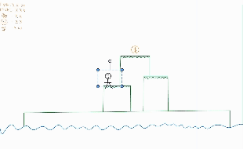

# 2025-group-25
2025 COMSM0166 group 25

## Your Game

Link to your game [PLAY HERE](https://peteinfo.github.io/COMSM0166-project-template/)

Your game lives in the [/docs](/docs) folder, and is published using Github pages to the link above.

Include a demo video of your game here (you don't have to wait until the end, you can insert a work in progress video)

## Table of Contents

- [1. Development Team](#1-development-team)
- [2. Game Research](#2-game-research)
- [3. Requirements](#3-requirements)

## 1. Development Team

  <strong>Figure 1</strong> 
  <em>Team Photp Week 1.</em>

  <strong>Table 1</strong> 
  <em>Team members, roles and contributions.</em>

| GROUP MEMBER | NAME | EMAIL | ROLE | CONTRIBUTIONS |
| :----: | :----: | :----: | :----: | :----: |
| 01 | CAILING YANG   | rl24638@bristol.ac.uk | TEST | TEST |
| 02 | JUNJIE YAN   | am24166@bristol.ac.uk | TEST | TEST |
| 03 | SHUAO ZHANG   | qk24065@bristol.ac.uk | TEST | TEST |
| 04 | KEXIN ZHANG   | hy24895@bristol.ac.uk | TEST | TEST |
| 05 | RUI XIONG   | yy24937@bristol.ac.uk | TEST | TEST |

## 2. Game Research
| Game Name                                 | Game Genre                    | Game Introduction                                                                                                                                                                                                                                                                                                                          | Game Mechanics                                                                                                                                                                                                                                                                                                                                                                                                                                                                                                                              | Inspiration                                                                                                                                                                                                                                                                                                                                                                                                                                                                     |
|-------------------------------------------|-------------------------------|--------------------------------------------------------------------------------------------------------------------------------------------------------------------------------------------------------------------------------------------------------------------------------------------------------------------------------------------|-------------------------------------------------------------------------------------------------------------------------------------------------------------------------------------------------------------------------------------------------------------------------------------------------------------------------------------------------------------------------------------------------------------------------------------------------------------------------------------------------------------------------------------------|---------------------------------------------------------------------------------------------------------------------------------------------------------------------------------------------------------------------------------------------------------------------------------------------------------------------------------------------------------------------------------------------------------------------------------------------------------------------------------|
| **Only Real Men Can Reach 100 Floors**    | Vertical Action Platformer    | Players control a character descending an endless tower. The goal is to reach the 100th floor as quickly as possible while avoiding obstacles and collecting items through quick reflexes and strategic decision-making. Each floor presents a unique challenge                                      | Normal Floor: Safe landing.   Fragile Floor: Breaks after a short duration.   Moving Floor: Moves horizontally, requiring precise timing to jump.   Spiked Floor: Instant death upon contact.   Bouncy Floor: Launches the character to lower floors. |1. Quick reactions are essential as the tower background continuously scrolls upward. The screen's upper edge features deadly spikes, which will kill the character if touched, introducing a time constraint.    2. This dynamic creates tension and inspires high-difficulty level designs for later stages of our game, enhancing the game's challenge and excitement.                                                                                                                                                                                                                                                                                                       |
| **Pac-Man**                               | Arcade                        | Players control Pac-Man, navigating a maze to eat all the pellets on the map while avoiding four ghost enemies (Blinky, Pinky, Inky, Clyde). If Pac-Man is caught by a ghost, the game ends.                                                                                                                                             | **Scoring System**:  Eating regular pellets provides basic points.  Consuming "Power Pellets" temporarily allows Pac-Man to eat ghosts, earning bonus points.   **Enemy AI**:  Each ghost exhibits unique movement patterns, such as chasing, ambushing, or moving randomly.   **Level Progression**:  As players advance, the ghosts’ speed and AI become increasingly challenging, making the gameplay more intense.   **Failure Condition**:  The game ends when Pac-Man runs out of lives after being caught by ghosts. | 1. Dynamic Challenge Through AI Behavior:  &nbsp;&nbsp;The unique behaviors of each ghost demonstrate how dynamic enemy AI can create strategic depth, inspiring us to incorporate varied and reactive challenges in our project.   2. Reward and Feedback Loops:  &nbsp;&nbsp;The scoring system and rewarding mechanics (e.g., eating ghosts for bonus points) highlight the importance of providing positive feedback to keep players engaged.   3. Tension and Pacing:  &nbsp;&nbsp;The increasing speed and aggressiveness of ghosts show how pacing adjustments can elevate tension, which can be applied to level designs in our project.   4. Simple Rules with Deep Gameplay:  &nbsp;&nbsp;The game's simple controls and rules lead to complex and engaging gameplay, suggesting that we can focus on depth through thoughtful mechanics instead of overloading players with complexity. |
| **Bomberman**                             | Arcade                        | Players control a character navigating a maze by placing bombs to destroy obstacles and enemies. Collect power-ups to increase bomb strength, speed, or capacity.                                                                                                                                                                         | **Strategic Bomb Placement**:  Strategically place bombs to break through barriers and eliminate enemies while avoiding self-damage. Planning and positioning are key to solving puzzles and navigating the maze.   **Dynamic Hazards**:  Each explosion creates a temporary hazard, altering the maze dynamically and forcing quick adaptations.   **Timed Objectives**:  Players must find hidden exits and clear levels before the timer runs out, balancing exploration, resource management, and survival under pressure. | 1. Tension through Dynamic Hazards:  &nbsp;&nbsp;Bomb explosions create chain reactions and temporary obstacles, inspiring ideas for interactive environments that change based on player actions.   2. Reward Systems:  &nbsp;&nbsp;Power-ups provide meaningful progression, encouraging exploration and creating a satisfying loop of discovery and growth.   3. Urgency through Timed Goals:  &nbsp;&nbsp;Time constraints add pressure and urgency, emphasizing quick thinking and decision-making.   4. Puzzle-Solving with Simple Mechanics:  &nbsp;&nbsp;The intuitive bomb-placement mechanic can inspire designs where simple rules lead to complex and rewarding puzzle challenges. |
| **Picopark**                              | Cooperative Puzzle-Platformer | PICO PARK is a cooperative puzzle-platformer for 2–8 players. Collect keys, stack on each other, and step on switches to unlock exits. Each level features unique puzzles, urging real-time communication and teamwork. With simple rules and controls, PICO PARK suits casual gatherings or online sessions perfectly.                         | **Key Collecting**:  Each stage contains at least one key needed to open the exit. The team must work together—moving or jumping in sync—to retrieve the key and reach the goal.   **Stacking & Synchronization**:  Some levels require players to stack on top of one another or simultaneously step on switches. Precise timing and coordinated actions are crucial for success.   **Team-based Physics**:  Multiple players moving at once can alter the overall physics, such as jump heights or balance points. Even minor missteps in coordination may lead to group failure. | 1. Co-op & Communication:  &nbsp;&nbsp;For teams aiming to create a Mario-style game, PICO PARK’s enforced cooperation can serve as inspiration, adding an extra layer of team-based fun on top of core platforming mechanics.   2. Varied Levels & Progressive Difficulty:  &nbsp;&nbsp;Each level in PICO PARK has its own unique gimmick, with difficulty ramping up steadily. This approach can be applied to platformers, ensuring players master controls before tackling advanced challenges.   3. Player Interaction & Fun Factor:  &nbsp;&nbsp;PICO PARK focuses on real-time interaction and teamwork, often leading to lively communication and humorous moments. Introducing local or online multiplayer elements in a Mario-like game can similarly leverage social interaction as a key selling point. |
| **The Legend of Zelda: Link's Awakening** | Action-Adventure Platformer    | This game is a unique chapter in the Zelda series where the protagonist, Link, finds himself on a mysterious island after a shipwreck during a storm. Combining exploration, puzzle-solving, collection, and combat, each area is filled with puzzles, secret paths, and formidable enemies.                                                    | **Diverse Environments**:  Players traverse a variety of environments such as beaches, forests, mountains, swamps, and underground caves, each with its unique visual style and mechanical challenges.   **Item System**:  Items are crucial for exploration. For example, acquiring a feather allows Link to jump over obstacles; obtaining heavy boots enables him to walk through deep sand and swamps.   **Intelligent Enemies and Boss Fights**:  In addition to regular enemies, each area features ingeniously designed boss battles. Each boss has unique weaknesses that players need to discover and exploit to prevail.   **Puzzle Elements**:  From simple lever-pulling to complex environmental puzzles, the game's puzzle design requires players to observe, think, and utilize their surroundings and items to solve challenges. | 1. Environmental Interaction and Platform Elements:  &nbsp;&nbsp;Each game environment is not just a backdrop but interactive, encouraging Mario-like games to also emphasize the multifunctionality and interactivity of environments.   2. Rich Layered Exploration:  &nbsp;&nbsp;Zelda games emphasize in-depth exploration, which can inspire Mario-like games to design more intricate, cleverly designed levels that encourage players to explore every corner.   3. Enemy and Combat Mechanics:  &nbsp;&nbsp;With a wide variety of enemies, each possessing different attack modes and weaknesses, this design can provide inspiration to make enemies in Mario-like games more diverse and challenging.   4. Integration of Puzzles and Items:  &nbsp;&nbsp;By integrating puzzles and specific items to solve problems, the game creates an engaging experience that requires players to think and physically interact, enhancing the interactivity and engagement of platform games. |

## 3. Requirements

### Ideation

  <b>Figure 1</b>

  <em>ideation game</em>

  

  

### Paper Prototype

  <b>Figure 2</b>

  <em>Paper Prototype</em>

  

  

### Digital Paper Prototype

  <b>Figure 3</b>

  <em>Digital Paper Prototype</em>

  

### Stakeholders

  <b>Figure 4</b>

  

### User Stories and Use Case Diagram
| User | Epic | User Stories |
|------|------|-------------|
| Player | Core Gameplay Mechanics | As a player, I want the game to feature random events (mystery boxes) and hidden levels to enhance unpredictability and replayability. |
| Player | Core Gameplay Mechanics | As a player, I want to hear sound effects for jumping, attacking, and collecting items to make the game feel more immersive. I also hope the background music changes dynamically with different levels. |
| Player | Accessibility & Customization | As a player, I want the option to turn off the background music freely so that I can focus on the gameplay without distractions. |
| Player | Core Gameplay Mechanics | As a player, I want to be able to use multiple attack types (melee and ranged) to adapt to different enemy types and enhance combat strategy. |
| New Player | Accessibility & Customization | As a new player, I want the game to provide a comprehensive tutorial and guidance so that I can quickly understand the rules and controls, improving my first-time experience and overall accessibility. |
| Game Developer | Social & Multiplayer Features | As a game developer, I want to implement interactive features such as online leaderboards and multiplayer co-op mode to enhance player engagement and gameplay experience. |
| Game Designer | Game World & Immersion | As a game designer, I want to implement a dynamic weather system that allows the background of a level to change automatically based on game progress. This will enhance player immersion and create deeper interactions between the environment and gameplay. |

- **Acceptance Criteria：**
  - As a new player, I want the game to provide a comprehensive tutorial and guidance so that I can quickly understand the rules and controls, improving my first-time experience and overall accessibility.  
Acceptance Criteria：We have added a gameplay instructions and item display interface before the game starts to ensure that players understand the basic rules and controls before entering a level. During gameplay, players can access the tutorial and item descriptions at any time via the settings button to review key information.
  - As a game designer, I want to implement a dynamic weather system that allows the background of a level to change automatically based on game progress. This will enhance player immersion and create deeper interactions between the environment and gameplay.
Acceptance Criteria：The game should feature dynamic weather conditions such as sunny, rainy, snowy, thunderstorms, and foggy, changing with level progression. Each weather type should impact the environment and gameplay, such as slippery surfaces in rain, ice formation in snow, lightning effects in storms, and reduced visibility in fog. Weather effects should include matching visuals and sounds to enhance immersion.

  <b>Figure 5</b>

## 3. Introduction

- 5% ~250 words 
- Describe your game, what is based on, what makes it novel? 

----
The above part is our result （上面部分是我们完成的成果）  
The following is the template（以下是老师提供的模版）

---

## Project Report

### Introduction

- 5% ~250 words 
- Describe your game, what is based on, what makes it novel? 

### Requirements 

- 15% ~750 words
- Use case diagrams, user stories. Early stages design. Ideation process. How did you decide as a team what to develop? 

### Design

- 15% ~750 words 
- System architecture. Class diagrams, behavioural diagrams. 

### Implementation

- 15% ~750 words

- Describe implementation of your game, in particular highlighting the three areas of challenge in developing your game. 

### Evaluation

- 15% ~750 words

- One qualitative evaluation (your choice) 

- One quantitative evaluation (of your choice) 

- Description of how code was tested. 

### Process 

- 15% ~750 words

- Teamwork. How did you work together, what tools did you use. Did you have team roles? Reflection on how you worked together. 

### Conclusion

- 10% ~500 words

- Reflect on project as a whole. Lessons learned. Reflect on challenges. Future work. 

### Contribution Statement

- Provide a table of everyone's contribution, which may be used to weight individual grades. We expect that the contribution will be split evenly across team-members in most cases. Let us know as soon as possible if there are any issues with teamwork as soon as they are apparent. 

### Additional Marks

You can delete this section in your own repo, it's just here for information. in addition to the marks above, we will be marking you on the following two points:

- **Quality** of report writing, presentation, use of figures and visual material (5%) 
  - Please write in a clear concise manner suitable for an interested layperson. Write as if this repo was publicly available.

- **Documentation** of code (5%)

  - Is your repo clearly organised? 
  - Is code well commented throughout?
