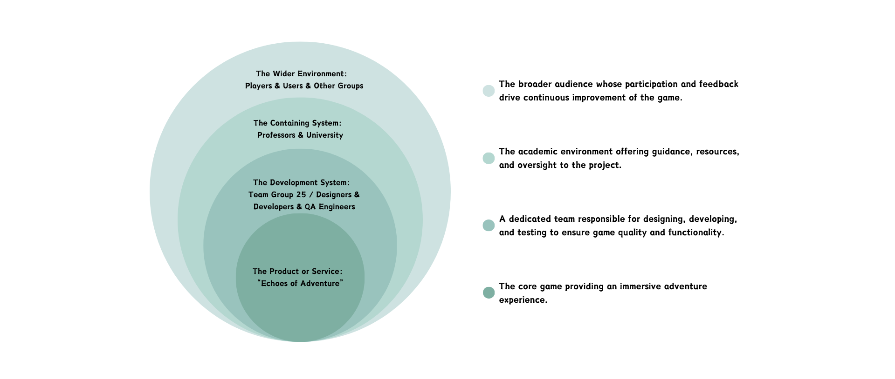

# 2025-group-25
2025 COMSM0166 group 25

## Your Game

Link to your game [PLAY HERE](https://uob-comsm0166.github.io/2025-group-25/)

Your game lives in the [/docs](/docs) folder, and is published using Github pages to the link above.

Include a demo video of your game here (you don't have to wait until the end, you can insert a work in progress video)

## Table of Contents

- [1. Development Team](#1-development-team)
- [2. Game Research](#2-game-research)
- [3. Requirements](#3-requirements)
- [7. Process](#7-process)

## 1. Development Team

  <strong>Figure 1</strong> 
  <em>Team Photp Week 1.</em>

  <strong>Table 1</strong> 
  <em>Team members, roles and contributions.</em>

| GROUP MEMBER | NAME | EMAIL | ROLE | CONTRIBUTIONS |
| :----: | :----: | :----: | :----: | :----: |
| 01 | CAILING YANG   | rl24638@bristol.ac.uk | TEST | TEST |
| 02 | JUNJIE YAN   | am24166@bristol.ac.uk | TEST | TEST |
| 03 | SHUAO ZHANG   | qk24065@bristol.ac.uk | TEST | TEST |
| 04 | KEXIN ZHANG   | hy24895@bristol.ac.uk | TEST | Assisted in providing code modifications for in-game item functionality, such as item collection and attack effects. Also helped optimize player interactions and sound effect management. Additionally, contributed to setting up and adjusting gold-related features, including gold collection, display, and usage logic. |
| 05 | RUI XIONG   | yy24937@bristol.ac.uk | TEST | TEST |

## 2. Game Research
| Game Name                                 | Game Genre                    | Game Introduction                                                                                                                                                                                                                                                                                                                          | Game Mechanics                                                                                                                                                                                                                                                                                                                                                                                                                                                                                                                              | Inspiration                                                                                                                                                                                                                                                                                                                                                                                                                                                                     |
|-------------------------------------------|-------------------------------|--------------------------------------------------------------------------------------------------------------------------------------------------------------------------------------------------------------------------------------------------------------------------------------------------------------------------------------------|-------------------------------------------------------------------------------------------------------------------------------------------------------------------------------------------------------------------------------------------------------------------------------------------------------------------------------------------------------------------------------------------------------------------------------------------------------------------------------------------------------------------------------------------|---------------------------------------------------------------------------------------------------------------------------------------------------------------------------------------------------------------------------------------------------------------------------------------------------------------------------------------------------------------------------------------------------------------------------------------------------------------------------------|
| **Only Real Men Can Reach 100 Floors**    | Vertical Action Platformer    | Players control a character descending an endless tower. The goal is to reach the 100th floor as quickly as possible while avoiding obstacles and collecting items through quick reflexes and strategic decision-making. Each floor presents a unique challenge                                      | Normal Floor: Safe landing.   Fragile Floor: Breaks after a short duration.   Moving Floor: Moves horizontally, requiring precise timing to jump.   Spiked Floor: Instant death upon contact.   Bouncy Floor: Launches the character to lower floors. |1. Quick reactions are essential as the tower background continuously scrolls upward. The screen's upper edge features deadly spikes, which will kill the character if touched, introducing a time constraint.    2. This dynamic creates tension and inspires high-difficulty level designs for later stages of our game, enhancing the game's challenge and excitement.                                                                                                                                                                                                                                                                                                       |
| **Pac-Man**                               | Arcade                        | Players control Pac-Man, navigating a maze to eat all the pellets on the map while avoiding four ghost enemies (Blinky, Pinky, Inky, Clyde). If Pac-Man is caught by a ghost, the game ends.                                                                                                                                             | **Scoring System**:  Eating regular pellets provides basic points.  Consuming "Power Pellets" temporarily allows Pac-Man to eat ghosts, earning bonus points.   **Enemy AI**:  Each ghost exhibits unique movement patterns, such as chasing, ambushing, or moving randomly.   **Level Progression**:  As players advance, the ghosts’ speed and AI become increasingly challenging, making the gameplay more intense.   **Failure Condition**:  The game ends when Pac-Man runs out of lives after being caught by ghosts. | 1. Dynamic Challenge Through AI Behavior:  &nbsp;&nbsp;The unique behaviors of each ghost demonstrate how dynamic enemy AI can create strategic depth, inspiring us to incorporate varied and reactive challenges in our project.   2. Reward and Feedback Loops:  &nbsp;&nbsp;The scoring system and rewarding mechanics (e.g., eating ghosts for bonus points) highlight the importance of providing positive feedback to keep players engaged.   3. Tension and Pacing:  &nbsp;&nbsp;The increasing speed and aggressiveness of ghosts show how pacing adjustments can elevate tension, which can be applied to level designs in our project.   4. Simple Rules with Deep Gameplay:  &nbsp;&nbsp;The game's simple controls and rules lead to complex and engaging gameplay, suggesting that we can focus on depth through thoughtful mechanics instead of overloading players with complexity. |
| **Bomberman**                             | Arcade                        | Players control a character navigating a maze by placing bombs to destroy obstacles and enemies. Collect power-ups to increase bomb strength, speed, or capacity.                                                                                                                                                                         | **Strategic Bomb Placement**:  Strategically place bombs to break through barriers and eliminate enemies while avoiding self-damage. Planning and positioning are key to solving puzzles and navigating the maze.   **Dynamic Hazards**:  Each explosion creates a temporary hazard, altering the maze dynamically and forcing quick adaptations.   **Timed Objectives**:  Players must find hidden exits and clear levels before the timer runs out, balancing exploration, resource management, and survival under pressure. | 1. Tension through Dynamic Hazards:  &nbsp;&nbsp;Bomb explosions create chain reactions and temporary obstacles, inspiring ideas for interactive environments that change based on player actions.   2. Reward Systems:  &nbsp;&nbsp;Power-ups provide meaningful progression, encouraging exploration and creating a satisfying loop of discovery and growth.   3. Urgency through Timed Goals:  &nbsp;&nbsp;Time constraints add pressure and urgency, emphasizing quick thinking and decision-making.   4. Puzzle-Solving with Simple Mechanics:  &nbsp;&nbsp;The intuitive bomb-placement mechanic can inspire designs where simple rules lead to complex and rewarding puzzle challenges. |
| **Picopark**                              | Cooperative Puzzle-Platformer | PICO PARK is a cooperative puzzle-platformer for 2–8 players. Collect keys, stack on each other, and step on switches to unlock exits. Each level features unique puzzles, urging real-time communication and teamwork. With simple rules and controls, PICO PARK suits casual gatherings or online sessions perfectly.                         | **Key Collecting**:  Each stage contains at least one key needed to open the exit. The team must work together—moving or jumping in sync—to retrieve the key and reach the goal.   **Stacking & Synchronization**:  Some levels require players to stack on top of one another or simultaneously step on switches. Precise timing and coordinated actions are crucial for success.   **Team-based Physics**:  Multiple players moving at once can alter the overall physics, such as jump heights or balance points. Even minor missteps in coordination may lead to group failure. | 1. Co-op & Communication:  &nbsp;&nbsp;For teams aiming to create a Mario-style game, PICO PARK’s enforced cooperation can serve as inspiration, adding an extra layer of team-based fun on top of core platforming mechanics.   2. Varied Levels & Progressive Difficulty:  &nbsp;&nbsp;Each level in PICO PARK has its own unique gimmick, with difficulty ramping up steadily. This approach can be applied to platformers, ensuring players master controls before tackling advanced challenges.   3. Player Interaction & Fun Factor:  &nbsp;&nbsp;PICO PARK focuses on real-time interaction and teamwork, often leading to lively communication and humorous moments. Introducing local or online multiplayer elements in a Mario-like game can similarly leverage social interaction as a key selling point. |
| **The Legend of Zelda: Link's Awakening** | Action-Adventure Platformer    | This game is a unique chapter in the Zelda series where the protagonist, Link, finds himself on a mysterious island after a shipwreck during a storm. Combining exploration, puzzle-solving, collection, and combat, each area is filled with puzzles, secret paths, and formidable enemies.                                                    | **Diverse Environments**:  Players traverse a variety of environments such as beaches, forests, mountains, swamps, and underground caves, each with its unique visual style and mechanical challenges.   **Item System**:  Items are crucial for exploration. For example, acquiring a feather allows Link to jump over obstacles; obtaining heavy boots enables him to walk through deep sand and swamps.   **Intelligent Enemies and Boss Fights**:  In addition to regular enemies, each area features ingeniously designed boss battles. Each boss has unique weaknesses that players need to discover and exploit to prevail.   **Puzzle Elements**:  From simple lever-pulling to complex environmental puzzles, the game's puzzle design requires players to observe, think, and utilize their surroundings and items to solve challenges. | 1. Environmental Interaction and Platform Elements:  &nbsp;&nbsp;Each game environment is not just a backdrop but interactive, encouraging Mario-like games to also emphasize the multifunctionality and interactivity of environments.   2. Rich Layered Exploration:  &nbsp;&nbsp;Zelda games emphasize in-depth exploration, which can inspire Mario-like games to design more intricate, cleverly designed levels that encourage players to explore every corner.   3. Enemy and Combat Mechanics:  &nbsp;&nbsp;With a wide variety of enemies, each possessing different attack modes and weaknesses, this design can provide inspiration to make enemies in Mario-like games more diverse and challenging.   4. Integration of Puzzles and Items:  &nbsp;&nbsp;By integrating puzzles and specific items to solve problems, the game creates an engaging experience that requires players to think and physically interact, enhancing the interactivity and engagement of platform games. |

## 3. Requirements
当然可以！以下是你提供内容整理成的 Markdown 格式文档，适用于 GitHub README 或其他 Markdown 渲染环境中查看：

---

# 3.1 Requirement Engineering

Requirements Engineering (RE) is a critical process in software development that defines and manages system requirements to ensure alignment with user needs. In the game industry, RE plays an even more vital role due to the dynamic nature of game design and the complexity of stakeholder expectations.

A comprehensive study by **Hussain et al. (2018)** highlights that successful game development requires a structured RE approach to mitigate common pitfalls such as ambiguous requirements, scope creep, and misaligned stakeholder expectations. Without clear requirement specifications, game projects often suffer from inefficiencies, extended development timelines, and feature bloat.

A survey conducted by **Borg et al. (2019)** on Global Game Jam participants identified *iterative brainstorming* as the most commonly used technique for conceptualizing initial requirements in game development. Unlike traditional software engineering projects, where requirements are often static, game development embraces flexibility, allowing creative ideation while maintaining structured requirement tracking.

The study also found that **scope management** is a prevalent challenge, with teams frequently struggling to balance innovation with realistic deliverables. Poorly managed requirements often lead to *feature creep*, where excessive, unplanned functionalities are introduced, delaying project timelines and increasing development costs.

> **Figure 1.** Methods used for gathering the initial set of expectations (requirements)  
> *Source: Adapted from Borg et al. (2019).*

---

# 3.2 Ideation Processing

In the early stages of the project, we utilized **Feishu Docs** for brainstorming and information integration. We initially proposed incorporating a **power-up system** to enhance player interaction.

To accommodate players with varying skill levels, we designed two gameplay modes:

- **Invincible Mode**: Players can freely select levels for a more accessible experience.
- **Normal Mode**: Players must start from the first level, providing a structured challenge.

This dual-mode design improves adaptability and enhances the overall playability.

> **Figure 2.** Brainstorming via Feishu Docs

During the third session on **January 28**, our team of five members was divided into two groups:

- Three members: Responsible for constructing the **paper prototype**.
- Two members: Focused on converting it into a **digital wireframe**.

> **Figure 3.** Paper Prototype developed during Workshop Three  
> *(Image placeholder: www.google.com)*

---

# 3.3 Feasibility Studies

Given that none of our team members had prior game development experience, we conducted a series of feasibility tests. During these, we noticed:

- Player movement speed varied under different **weather conditions**.
- Transitions between weather states caused **player confusion** due to lack of visual/auditory cues.

**Solutions implemented:**

- Added a **Heads-Up Display (HUD)** to indicate current weather.
- Introduced **distinct audio cues** (e.g., rain sounds, snow ambiance).
- Enhanced **immersion and usability** through combined visual and audio feedback.

---

# 3.4 Identifying Stakeholders

> **Figure 4.** Onion Model of *Oiram* Game

### Stakeholder Roles & Environmental Context

Our Onion Model helped us differentiate between types of feedback:

- **Professors**: Provided strategic and academic guidance.
- **Peers**: Offered usability feedback reflective of real user experience.

This dual-layer feedback helped:

- Validate design concepts against theoretical and professional benchmarks.
- Gather informal, practical insights about **gameplay interaction** and **difficulty**.

**Limitations**:
- Surrogate stakeholders may not reflect full diversity of real players.

**Future Improvement**:
- Incorporate **external player testing** to combine real-user data with academic feedback.

---

# 3.5 Identifying Top-Level Needs with User Stories

## 3.5.1 Player Needs

- *As a player*, I want the game to feature **random events** (mystery boxes) and **hidden levels** to enhance unpredictability and replayability.
- *As a player*, I want to hear **sound effects** for actions and **dynamic background music** for immersion.
- *As a player*, I want to use **multiple attack types** (melee and ranged) for better combat strategy.
- *As a new player*, I want a **comprehensive tutorial** to understand the rules and controls.

  **Acceptance Criteria**:
  - Gameplay instructions and item descriptions are shown before levels.
  - Accessible tutorial and settings during gameplay.

- *As a visually impaired or elderly player*, I want to **customize font size and color** to improve readability.
- *As a player*, I want **realistic HCI interactions** with dynamic visuals to enhance immersion.

## 3.5.2 Developer & Designer Needs

- *As a developer*, I want to implement **online leaderboards** and **multiplayer co-op** to increase engagement.
- *As a designer*, I want to implement a **dynamic weather system** that changes based on game progress.

  **Acceptance Criteria**:
  - Weather includes sunny, rainy, snowy, thunderstorms, and foggy.
  - Each affects gameplay (e.g., slippery rain, icy snow, lightning effects).
  - Matching visuals and sounds required.

> We designed **character-driven posters** to visualize user stories, ensuring they remained top-of-mind during development and discussions.

---

# 3.6 Use-Cases Breakdown

To support diverse users and resolve testing issues, we implemented:

- A **difficulty selection system** on the start screen:
  - **Normal Mode**: Sequential level progression.
  - **Invincible Mode**: Free level selection with invulnerability.
- A **tutorial screen** before gameplay.
- An **in-game settings menu** to review instructions and items.
- Two **control schemes**:
  - WASD + Left Mouse Button
  - Arrow Keys + Z Key

> **Figure 5.** Use Case Diagram

---

# 3.7 Use-Case Specification

### Table 1: Normal Mode Use Case Specification

| Item | Description |
|------|-------------|
| **Use Case Description** | Player starts from Level 1 and collects all coins to activate the exit door and progress to Level 5. |
| **Goal** | Collect all coins, avoid damage, complete all levels to win. |
| **Main Flow** | 1. Enter Level 1 and collect coins.   2. Exit door activates after collecting all coins.   3. Repeat until Level 5 and win. |
| **Alternative Flow** | Contact with hazards causes damage. Game over when health is zero. |
| **Exception Flow** | On Game Over screen:   - Press "R" to restart level   - Press "P" for settings |

---

### Table 2: Invincible Mode Use Case Specification

| Item | Description |
|------|-------------|
| **Use Case Description** | Player selects any level and is immune to damage. |
| **Goal** | Freely explore and collect all coins. |
| **Main Flow** | 1. Select level (1-5).   2. Collect all coins.   3. Exit activates; proceed or reselect level. |
| **Alternative Flow** | No health impact from hazards. Player resets to safe platform if falling. |
| **Special Operation Flow** | - "P": Open settings   - "R": Restart level   - "M": Return to main menu |

---

### Table 3: Mode Differences

| Mode | Key Features | Target User |
|------|--------------|-------------|
| **Normal Mode** | Skill-based gameplay with real damage, sequential levels | Players who enjoy challenges |
| **Invincible Mode** | No damage, free level exploration | Players seeking relaxed experience |

---

### Ideation

  <b>Figure 1</b>

  <em>ideation game</em>

  

  

### Paper Prototype

  <b>Figure 2</b>

  <em>Paper Prototype</em>

  

  

### Digital Paper Prototype

  <b>Figure 3</b>

  <em>Digital Paper Prototype</em>

  

### Stakeholders

  <b>Figure 4</b>

  <em>Stakeholder</em>

  

### User Stories and Use Case Diagram
| User | Epic | User Stories |
|------|------|-------------|
| Player | Core Gameplay Mechanics | As a player, I want the game to feature random events (mystery boxes) and hidden levels to enhance unpredictability and replayability. |
| Player | Core Gameplay Mechanics | As a player, I want to hear sound effects for jumping, attacking, and collecting items to make the game feel more immersive. I also hope the background music changes dynamically with different levels. |
| Player | Accessibility & Customization | As a player, I want the option to turn off the background music freely so that I can focus on the gameplay without distractions. |
| Player | Core Gameplay Mechanics | As a player, I want to be able to use multiple attack types (melee and ranged) to adapt to different enemy types and enhance combat strategy. |
| New Player | Accessibility & Customization | As a new player, I want the game to provide a comprehensive tutorial and guidance so that I can quickly understand the rules and controls, improving my first-time experience and overall accessibility. |
| Game Developer | Social & Multiplayer Features | As a game developer, I want to implement interactive features such as online leaderboards and multiplayer co-op mode to enhance player engagement and gameplay experience. |
| Game Designer | Game World & Immersion | As a game designer, I want to implement a dynamic weather system that allows the background of a level to change automatically based on game progress. This will enhance player immersion and create deeper interactions between the environment and gameplay. |

#### **Acceptance Criteria：**
As a new player, I want the game to provide a comprehensive tutorial and guidance so that I can quickly understand the rules and controls, improving my first-time experience and overall accessibility.  
Acceptance Criteria：We have added a gameplay instructions and item display interface before the game starts to ensure that players understand the basic rules and controls before entering a level. During gameplay, players can access the tutorial and item descriptions at any time via the settings button to review key information.

As a game designer, I want to implement a dynamic weather system that allows the background of a level to change automatically based on game progress. This will enhance player immersion and create deeper interactions between the environment and gameplay.
Acceptance Criteria：The game should feature dynamic weather conditions such as sunny, rainy, snowy, thunderstorms, and foggy, changing with level progression. Each weather type should impact the environment and gameplay, such as slippery surfaces in rain, ice formation in snow, lightning effects in storms, and reduced visibility in fog. Weather effects should include matching visuals and sounds to enhance immersion.

  <b>Figure 5</b>

## 7. Process
### Collaboration
In the early stages, our meetings were held frequently. We began by discussing the gaming history of our team members to develop a unique game that better suited our group, was creative, and aligned with the majority’s preferences. We used the classroom whiteboard for simple game concept brainstorming and model sketching.

  <b>Figure 6</b>

  <em>Team Meeting Paper Prototype</em>

  

During this period, all our decisions were made through voting. Simple tasks were decided by a show of hands in face-to-face meetings, while more complex tasks, such as determining the game type, were handled using the voting mini-program in WeChat. This allowed us to vote anonymously and express our opinions freely.

  <b>Figure 7</b>

  <em>Voting results</em>

  

In fact, after forming the team, we created a discussion group on WeChat to communicate about development progress and any issues encountered during the process. At the beginning of the project, we scheduled face-to-face meetings every weekend to summarize the week's progress and assign tasks for the upcoming week.

  <b>Figure 8</b>

  <em>Team Meeting</em>

  

At the same time, as the project progressed, we also held offline discussions periodically to merge code at different stages (e.g., after the lab session every Tuesday).

  <b>Figure 9</b>

  <em>Merge code</em>

  

### Gantt Chart

  <b>Figure 9</b>

  <em>Gantt Chart of Game Project</em>

  

Here is the link to our complete Gantt chart:(https://a6czq5caio.feishu.cn/share/base/view/shrcnfCyBjiH5Cu0MpCVYYkOBjh)

### Tools and Techniques
In this project, we adopted a variety of tools and techniques to ensure efficient collaboration and smooth progress throughout the development process.

We used Lark as our primary online documentation tool. By setting up project discussion groups and shared documents on Lark, our team was able to communicate in real time, share meeting minutes, discuss task requirements, and flexibly add text, images, and diagrams. This method centralized all important information, greatly improving the efficiency of information retrieval and task tracking.

For the development environment, we chose VS Code. Leveraging VS Code’s powerful plugin support—such as Live Share—we implemented real-time pair programming and collaborative debugging, ensuring that team members could resolve issues simultaneously and optimize code quality together. Our project code is primarily based on p5.js, which provides an intuitive, interactive graphics programming platform that is well-suited for rapid development and iterative game functionality.

Additionally, we established a code repository on GitHub and extensively adopted the Pull Request mechanism for code reviews. Every code submission was reviewed by team members, ensuring adherence to coding standards and maintaining high-quality project code. Through this comprehensive use of multiple tools and techniques, we achieved efficient team collaboration and project management, laying a solid foundation for the project’s success.

### Agile Dicussion
In this project, we adopted agile discussion methods to ensure efficient team collaboration and smooth project progress. We primarily used two formats: daily stand-up meetings and backlog refinement sessions. While daily stand-ups usually require face-to-face reporting by team members, we flexibly adapted this to real-time reporting in a WeChat group based on our actual circumstances. This not only ensured timely information sharing but also enhanced communication efficiency. Meanwhile, we held a weekly offline backlog refinement meeting at MVB to focus on discussing and assigning phased tasks, ensuring that every team member was clear on current priorities and objectives. Through this flexible and diverse agile discussion approach, we successfully enhanced team collaboration efficiency and laid a solid foundation for the smooth progress of the project.
============================以下是模板部分===============================

## 3. Introduction

- When designing Echoes of Adventure, our goal was to create a platformer that was easy to pick up yet hard to master, while ensuring it appealed to a wide variety of players. Whether you're a beginner or someone who struggles with fast-paced keyboard and mouse controls, this game provides an experience that’s both fun and rewarding. Drawing inspiration from classic platformers, we aimed to make a game that anyone can enjoy while offering increasing challenges and a deep sense of achievement as you progress through the world.
- In the ancient and mysterious world of Echoes of Adventure, the land nurtures five magical continents: Emerald Isles, Lava Castle, Celestial Citadel, Shadow Realm, and Crystal Caverns. However, a sudden catastrophe struck, disrupting the balance of elemental power. As a player, you control a small but courageous fox, traversing various landscapes, overcoming environmental challenges, and using elemental powers to solve puzzles and defeat enemies. Each continent offers unique elements and trials that require strategic thinking and quick reflexes. With each challenge you conquer, you’ll gain more power, uncover secrets, and progress closer to restoring the balance of the world.
- In Echoes of Adventure, you will find a range of powers and items that will help you along your journey. From elemental hearts that boost your health to powerful elemental energy that grants you devastating abilities, these items can be used strategically to overcome obstacles, defeat dark creatures, and unlock new areas. Collecting mystic coins is crucial, as they are the key to advancing to the next continent and unlocking further adventures.
- With dynamic platforms, time-based puzzles, and a range of enemies, Echoes of Adventure is designed to keep you on your toes, ensuring that every moment of gameplay offers something new to discover. It’s time to embark on an epic journey and restore the elemental balance. Are you ready for the adventure of a lifetime?
  
### Table 1. Enemies

| Name | Image | Description |
| ---------------- | ------------- | ------------------- |
| **Frog**      | | Jumps around within a specified range. If not frozen, jumps between left and right randomly. When it touches the ground, it becomes idle.   |
| **Spider**    | | Moves within a specified patrol range. If not frozen, moves back and forth horizontally and changes direction when reaching patrol limits.    |
| **Bird**        |  | Flies up and down with a sinusoidal motion. If not frozen, changes direction once it reaches a maximum vertical amplitude.    |
| **Bat**        |   | Patrols within a fixed horizontal range, moving back and forth while flying up and down.    |
| **Fish**        |    | Swims up and down with sinusoidal motion.    |
| **Ghost**      |    |It can temporarily disappear and reappear, which is difficult to track.   |

### Table 2. Items

|Name | Image | Description |
| --------------------- | ------------- | ------------------- |
| **Coin** || Collect 12 coins in each level to unlock the exit door and proceed to the next level or complete the stage.   |
| **Heart**|| Restores one extra life. Maximum 5 lives.   |
| **Flame Element** || Allows the player to use fire-based attacks.   |
| **Freeze Element** | test | Freezes enemies temporarily, making them vulnerable to attacks.   |
| **Thunder Element**  | test| Puts a bomb that explodes after a short delay, damaging enemies in its vicinity.   |

### Table 3. Obstacles

|Name | Image | Description |
| ---------------------- | -------------------------- | ------------------- |
| **Axe** || A swinging axe that deals damage to the player when touched.   |
| **Water**  || A water hazard that can drown the player if submerged.   |
| **Magma** || A pool of magma that damages the player if they come in contact.   |
| **Saws** || A rotating saw blade that causes damage to the player when it touches them.   |
| **Spiked Wall** || A wall with spikes that damages the player on contact.   |

----
The above part is our result （上面部分是我们完成的成果）  
The following is the template（以下是老师提供的模版）

---

## Project Report

### Introduction

- 5% ~250 words 
- Describe your game, what is based on, what makes it novel? 

### Requirements 

- 15% ~750 words
- Use case diagrams, user stories. Early stages design. Ideation process. How did you decide as a team what to develop? 

### Design

- 15% ~750 words 
- System architecture. Class diagrams, behavioural diagrams. 

### Implementation

- 15% ~750 words

- Describe implementation of your game, in particular highlighting the three areas of challenge in developing your game. 

### Evaluation

- 15% ~750 words

- One qualitative evaluation (your choice) 

- One quantitative evaluation (of your choice) 

- Description of how code was tested. 

### Process 

- 15% ~750 words

- Teamwork. How did you work together, what tools did you use. Did you have team roles? Reflection on how you worked together. 

### Conclusion

- 10% ~500 words

- Reflect on project as a whole. Lessons learned. Reflect on challenges. Future work. 

### Contribution Statement

- Provide a table of everyone's contribution, which may be used to weight individual grades. We expect that the contribution will be split evenly across team-members in most cases. Let us know as soon as possible if there are any issues with teamwork as soon as they are apparent. 

### Additional Marks

You can delete this section in your own repo, it's just here for information. in addition to the marks above, we will be marking you on the following two points:

- **Quality** of report writing, presentation, use of figures and visual material (5%) 
  - Please write in a clear concise manner suitable for an interested layperson. Write as if this repo was publicly available.

- **Documentation** of code (5%)

  - Is your repo clearly organised? 
  - Is code well commented throughout?
