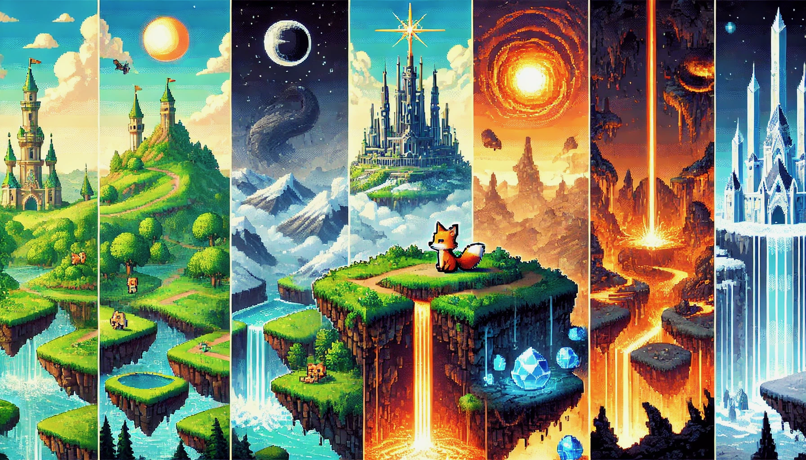
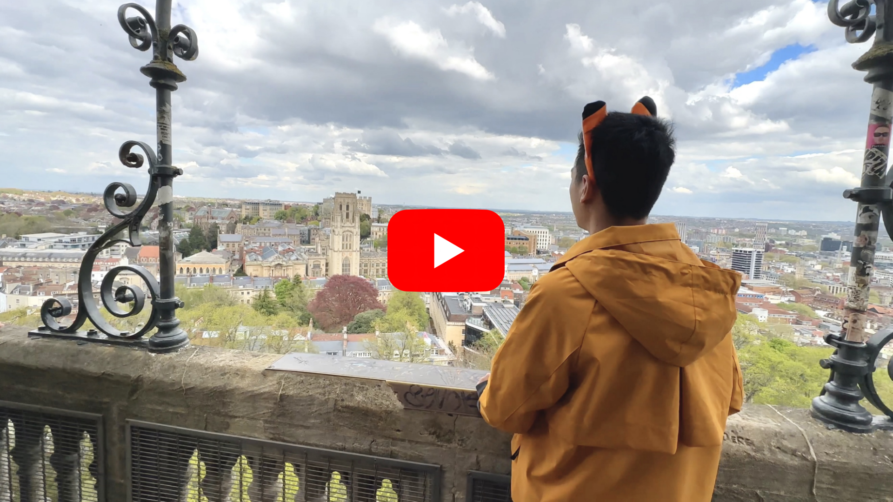
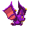
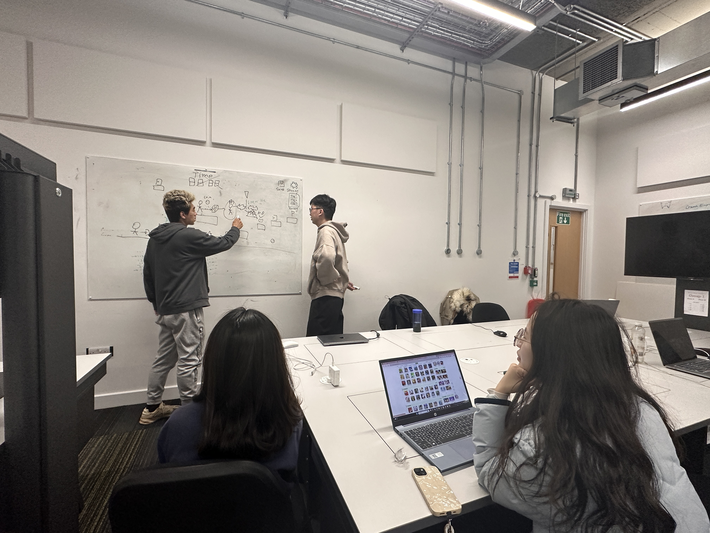
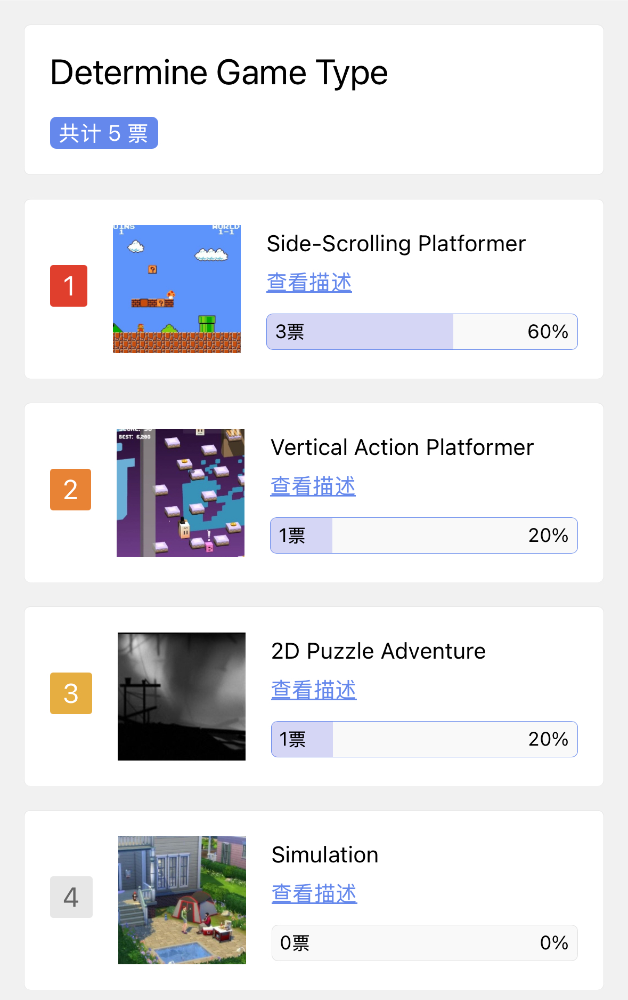
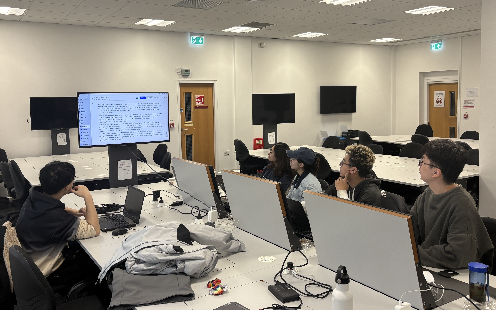
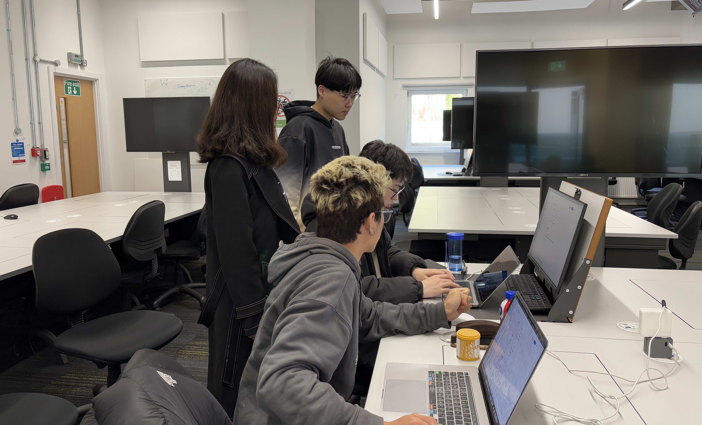
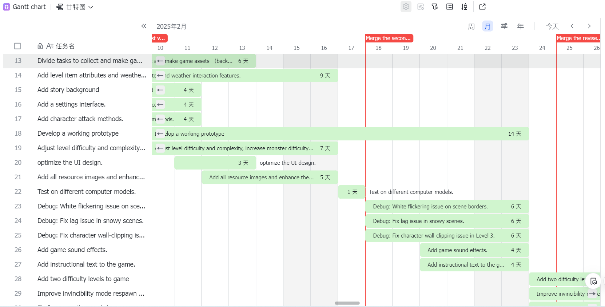

# 2025-group-25
2025 COMSM0166 group 25

## Your Game

  

Link to play our game [PLAY HERE](https://uob-comsm0166.github.io/2025-group-25/)

Our game lives in the [/docs](/docs) folder, and is published using Github pages to the link above.

Click to the demo video of our game here！

  

## Table of Contents

- [1. Development Team](#1-development-team)
- [2. Introduction](#2-introduction)
- [3. Game Research](#3-game-research)
- [4. Requirements](#4-requirements)
- [5. Design](#5-design)
- [6. Implementation](#6-implementation)
- [7. Evaluation](#7-evaluation)
- [8. Process](#8-process)
- [9. Sustainability](#9-sustainability)
- [10. Conclusion](#10-conclusion)
- [Reference](#reference)

## 1. Development Team

  <strong>Figure 1</strong> 
  <em>Team Photp Week 1.</em>

  

  <strong>Table 1</strong> 
  <em>Team members, roles and contributions.</em>

| GROUP MEMBER | NAME | EMAIL | ROLE | CONTRIBUTIONS |
| :----: | :----: | :----: | :----: | :----: |
| 01 | CAILING YANG   | rl24638@bristol.ac.uk | TEST | TEST |
| 02 | JUNJIE YAN   | am24166@bristol.ac.uk | TEST | TEST |
| 03 | SHUAO ZHANG   | qk24065@bristol.ac.uk | TEST | TEST |
| 04 | KEXIN ZHANG   | hy24895@bristol.ac.uk | TEST | Assisted in providing code modifications for in-game item functionality, such as item collection and attack effects. Also helped optimize player interactions and sound effect management. Additionally, contributed to setting up and adjusting gold-related features, including gold collection, display, and usage logic. |
| 05 | RUI XIONG   | yy24937@bristol.ac.uk | TEST | TEST |

## 2. Introduction

- When designing Echoes of Adventure, our goal was to create a platformer that was easy to pick up yet hard to master, while ensuring it appealed to a wide variety of players. Whether you're a beginner or someone who struggles with fast-paced keyboard and mouse controls, this game provides an experience that’s both fun and rewarding. Drawing inspiration from classic platformers, we aimed to make a game that anyone can enjoy while offering increasing challenges and a deep sense of achievement as you progress through the world.
- In the ancient and mysterious world of Echoes of Adventure, the land nurtures five magical continents: Emerald Isles, Lava Castle, Celestial Citadel, Shadow Realm, and Crystal Caverns. However, a sudden catastrophe struck, disrupting the balance of elemental power. As a player, you control a small but courageous fox, traversing various landscapes, overcoming environmental challenges, and using elemental powers to solve puzzles and defeat enemies. Each continent offers unique elements and trials that require strategic thinking and quick reflexes. With each challenge you conquer, you’ll gain more power, uncover secrets, and progress closer to restoring the balance of the world.
- In Echoes of Adventure, you will find a range of powers and items that will help you along your journey. From elemental hearts that boost your health to powerful elemental energy that grants you devastating abilities, these items can be used strategically to overcome obstacles, defeat dark creatures, and unlock new areas. Collecting mystic rubbish is crucial, as they are the key to advancing to the next continent and unlocking further adventures.
- With dynamic platforms, time-based puzzles, and a range of enemies, Echoes of Adventure is designed to keep you on your toes, ensuring that every moment of gameplay offers something new to discover. It’s time to embark on an epic journey and restore the elemental balance. Are you ready for the adventure of a lifetime?
  
### Table 1. Enemies

| Name | Image | Description |
| ---------------- | ------------- | ------------------- |
| **Frog**      | | Jumps around within a specified range. If not frozen, jumps between left and right randomly. When it touches the ground, it becomes idle.   |
| **Spider**    || Moves within a specified patrol range. If not frozen, moves back and forth horizontally and changes direction when reaching patrol limits.    |
| **Bird**        | | Flies up and down with a sinusoidal motion. If not frozen, changes direction once it reaches a maximum vertical amplitude.    |
| **Bat**        |   | Patrols within a fixed horizontal range, moving back and forth while flying up and down.    |
| **Ghost**      |    |It can temporarily disappear and reappear, which is difficult to track.   |

### Table 2. Items

|Name | Image | Description |
| --------------------- | ------------- | ------------------- |
| **Rubbish** || Collect 12 rubbish in each level to unlock the exit door and proceed to the next level or complete the stage.   |
| **Heart**|| Restores one extra life. Maximum 5 lives.   |
| **Freeze Element** | | Freezes enemies temporarily, making them vulnerable to attacks.   |
| **Flame Element** || Allows the player to use fire-based attacks.   |
| **Thunder Element**  | | Puts a bomb that explodes after a short delay, damaging enemies in its vicinity.   |

### Table 3. Obstacles

|Name | Image | Description |
| ---------------------- | -------------------------- | ------------------- |
| **Axe** || A swinging axe that deals damage to the player when touched.   |
| **Water**  || A water hazard that can drown the player if submerged.   |
| **Magma** || A pool of magma that damages the player if they come in contact.   |
| **Saws** || A rotating saw blade that causes damage to the player when it touches them.   |
| **Spiked Wall** || A wall with spikes that damages the player on contact.   |

## 3. Game Research
| Game Name                                 | Game Genre                    | Game Introduction                                                                                                                                                                                                                                                                                                                          | Game Mechanics                                                                                                                                                                                                                                                                                                                                                                                                                                                                                                                              | Inspiration                                                                                                                                                                                                                                                                                                                                                                                                                                                                     |
|-------------------------------------------|-------------------------------|--------------------------------------------------------------------------------------------------------------------------------------------------------------------------------------------------------------------------------------------------------------------------------------------------------------------------------------------|-------------------------------------------------------------------------------------------------------------------------------------------------------------------------------------------------------------------------------------------------------------------------------------------------------------------------------------------------------------------------------------------------------------------------------------------------------------------------------------------------------------------------------------------|---------------------------------------------------------------------------------------------------------------------------------------------------------------------------------------------------------------------------------------------------------------------------------------------------------------------------------------------------------------------------------------------------------------------------------------------------------------------------------|
| **Only Real Men Can Reach 100 Floors**    | Vertical Action Platformer    | Players control a character descending an endless tower. The goal is to reach the 100th floor as quickly as possible while avoiding obstacles and collecting items through quick reflexes and strategic decision-making. Each floor presents a unique challenge                                      | Normal Floor: Safe landing.   Fragile Floor: Breaks after a short duration.   Moving Floor: Moves horizontally, requiring precise timing to jump.   Spiked Floor: Instant death upon contact.   Bouncy Floor: Launches the character to lower floors. |1. Quick reactions are essential as the tower background continuously scrolls upward. The screen's upper edge features deadly spikes, which will kill the character if touched, introducing a time constraint.    2. This dynamic creates tension and inspires high-difficulty level designs for later stages of our game, enhancing the game's challenge and excitement.                                                                                                                                                                                                                                                                                                       |
| **Pac-Man**                               | Arcade                        | Players control Pac-Man, navigating a maze to eat all the pellets on the map while avoiding four ghost enemies (Blinky, Pinky, Inky, Clyde). If Pac-Man is caught by a ghost, the game ends.                                                                                                                                             | **Scoring System**:  Eating regular pellets provides basic points.  Consuming "Power Pellets" temporarily allows Pac-Man to eat ghosts, earning bonus points.   **Enemy AI**:  Each ghost exhibits unique movement patterns, such as chasing, ambushing, or moving randomly.   **Level Progression**:  As players advance, the ghosts’ speed and AI become increasingly challenging, making the gameplay more intense.   **Failure Condition**:  The game ends when Pac-Man runs out of lives after being caught by ghosts. | 1. Dynamic Challenge Through AI Behavior:  &nbsp;&nbsp;The unique behaviors of each ghost demonstrate how dynamic enemy AI can create strategic depth, inspiring us to incorporate varied and reactive challenges in our project.   2. Reward and Feedback Loops:  &nbsp;&nbsp;The scoring system and rewarding mechanics (e.g., eating ghosts for bonus points) highlight the importance of providing positive feedback to keep players engaged.   3. Tension and Pacing:  &nbsp;&nbsp;The increasing speed and aggressiveness of ghosts show how pacing adjustments can elevate tension, which can be applied to level designs in our project.   4. Simple Rules with Deep Gameplay:  &nbsp;&nbsp;The game's simple controls and rules lead to complex and engaging gameplay, suggesting that we can focus on depth through thoughtful mechanics instead of overloading players with complexity. |
| **Bomberman**                             | Arcade                        | Players control a character navigating a maze by placing bombs to destroy obstacles and enemies. Collect power-ups to increase bomb strength, speed, or capacity.                                                                                                                                                                         | **Strategic Bomb Placement**:  Strategically place bombs to break through barriers and eliminate enemies while avoiding self-damage. Planning and positioning are key to solving puzzles and navigating the maze.   **Dynamic Hazards**:  Each explosion creates a temporary hazard, altering the maze dynamically and forcing quick adaptations.   **Timed Objectives**:  Players must find hidden exits and clear levels before the timer runs out, balancing exploration, resource management, and survival under pressure. | 1. Tension through Dynamic Hazards:  &nbsp;&nbsp;Bomb explosions create chain reactions and temporary obstacles, inspiring ideas for interactive environments that change based on player actions.   2. Reward Systems:  &nbsp;&nbsp;Power-ups provide meaningful progression, encouraging exploration and creating a satisfying loop of discovery and growth.   3. Urgency through Timed Goals:  &nbsp;&nbsp;Time constraints add pressure and urgency, emphasizing quick thinking and decision-making.   4. Puzzle-Solving with Simple Mechanics:  &nbsp;&nbsp;The intuitive bomb-placement mechanic can inspire designs where simple rules lead to complex and rewarding puzzle challenges. |
| **Picopark**                              | Cooperative Puzzle-Platformer | PICO PARK is a cooperative puzzle-platformer for 2–8 players. Collect keys, stack on each other, and step on switches to unlock exits. Each level features unique puzzles, urging real-time communication and teamwork. With simple rules and controls, PICO PARK suits casual gatherings or online sessions perfectly.                         | **Key Collecting**:  Each stage contains at least one key needed to open the exit. The team must work together—moving or jumping in sync—to retrieve the key and reach the goal.   **Stacking & Synchronization**:  Some levels require players to stack on top of one another or simultaneously step on switches. Precise timing and coordinated actions are crucial for success.   **Team-based Physics**:  Multiple players moving at once can alter the overall physics, such as jump heights or balance points. Even minor missteps in coordination may lead to group failure. | 1. Co-op & Communication:  &nbsp;&nbsp;For teams aiming to create a Mario-style game, PICO PARK’s enforced cooperation can serve as inspiration, adding an extra layer of team-based fun on top of core platforming mechanics.   2. Varied Levels & Progressive Difficulty:  &nbsp;&nbsp;Each level in PICO PARK has its own unique gimmick, with difficulty ramping up steadily. This approach can be applied to platformers, ensuring players master controls before tackling advanced challenges.   3. Player Interaction & Fun Factor:  &nbsp;&nbsp;PICO PARK focuses on real-time interaction and teamwork, often leading to lively communication and humorous moments. Introducing local or online multiplayer elements in a Mario-like game can similarly leverage social interaction as a key selling point. |
| **The Legend of Zelda: Link's Awakening** | Action-Adventure Platformer    | This game is a unique chapter in the Zelda series where the protagonist, Link, finds himself on a mysterious island after a shipwreck during a storm. Combining exploration, puzzle-solving, collection, and combat, each area is filled with puzzles, secret paths, and formidable enemies.                                                    | **Diverse Environments**:  Players traverse a variety of environments such as beaches, forests, mountains, swamps, and underground caves, each with its unique visual style and mechanical challenges.   **Item System**:  Items are crucial for exploration. For example, acquiring a feather allows Link to jump over obstacles; obtaining heavy boots enables him to walk through deep sand and swamps.   **Intelligent Enemies and Boss Fights**:  In addition to regular enemies, each area features ingeniously designed boss battles. Each boss has unique weaknesses that players need to discover and exploit to prevail.   **Puzzle Elements**:  From simple lever-pulling to complex environmental puzzles, the game's puzzle design requires players to observe, think, and utilize their surroundings and items to solve challenges. | 1. Environmental Interaction and Platform Elements:  &nbsp;&nbsp;Each game environment is not just a backdrop but interactive, encouraging Mario-like games to also emphasize the multifunctionality and interactivity of environments.   2. Rich Layered Exploration:  &nbsp;&nbsp;Zelda games emphasize in-depth exploration, which can inspire Mario-like games to design more intricate, cleverly designed levels that encourage players to explore every corner.   3. Enemy and Combat Mechanics:  &nbsp;&nbsp;With a wide variety of enemies, each possessing different attack modes and weaknesses, this design can provide inspiration to make enemies in Mario-like games more diverse and challenging.   4. Integration of Puzzles and Items:  &nbsp;&nbsp;By integrating puzzles and specific items to solve problems, the game creates an engaging experience that requires players to think and physically interact, enhancing the interactivity and engagement of platform games. |

## 4. Requirements

### 4.1 Requirement Engineering
Requirements Engineering (RE) is a critical process in software development that defines and manages system requirements to ensure alignment with user needs. In the game industry, RE plays an even more vital role due to the dynamic nature of game design and the complexity of stakeholder expectations. A comprehensive study by Hussain et al. (2018) highlights that successful game development requires a structured RE approach to mitigate common pitfalls such as ambiguous requirements, scope creep, and misaligned stakeholder expectations. Without clear requirement specifications, game projects often suffer from inefficiencies, extended development timelines, and feature bloat.
A survey conducted by Borg et al. (2019) on Global Game Jam participants identified iterative brainstorming as the most commonly used technique for conceptualizing initial requirements in game development. Unlike traditional software engineering projects, where requirements are often static, game development embraces flexibility, allowing creative ideation while maintaining structured requirement tracking. The study also found that scope management is a prevalent challenge, with teams frequently struggling to balance innovation with realistic deliverables. Poorly managed requirements often lead to feature creep, where excessive, unplanned functionalities are introduced, delaying project timelines and increasing development costs.

  

  <strong>Figure 1. Methods used for gathering the initial set of expectations (requirements)</strong> 
  <em>Source: Adapted from Borg et al. (2019).</em>

### 4.2 Ideation Processing
In the early stages of the project, we utilized Feishu Docs for brainstorming and information integration, and initially proposed incorporating a power-up system to enhance player interaction. Additionally, considering the varying skill levels of players, we designed two gameplay modes: Invincible Mode, which allows players to freely select levels for a more accessible experience, and Normal Mode, which requires players to start from the first level for a more structured challenge. This design aims to accommodate different player preferences and enhance the overall playability and adaptability of the game.

**Figure 2**

  

  

During the third session on January 28, our team of five members was systematically divided into two groups: one group of three members was responsible for constructing the paper prototype (Figure 2), while the other group of two members focused on converting it into a digital wireframe (Figure 3). Benefiting from a well-defined task allocation, we efficiently advanced the project and, through a structured visual design approach, transformed the initially complex game concept into a more intuitive and concrete representation, thereby enhancing its comprehensibility and precision of expression.

  

  <strong>Figure 3. Paper Prototype developed during Workshop Three</strong> 
  <em>(Paper Prototype: <a href="https://www.google.com">www.google.com</a>)</em>

### 4.3 Feasibility Studies
As none of our team members had prior experience in game development, we conducted a series of feasibility studies. During these tests, we observed that the player's movement speed varied under different weather conditions. However, when transitioning between weather states, some users found it difficult to immediately recognize the change, leading to confusion about what had occurred in the game.

To address this issue, we introduced a Heads-Up Display (HUD) to clearly indicate the current weather conditions. Additionally, we incorporated distinct background music—such as rain sounds for rainy weather and snow-themed audio for snowy conditions. These auditory and visual cues were designed to provide players with intuitive feedback, enabling them to quickly identify and adapt to changing weather conditions.

Through this iterative refinement process, we aimed to enhance player immersion and usability, ensuring that weather transitions felt both natural and comprehensible. By leveraging a combination of UI elements and environmental audio cues, we improved the overall game experience, making it more accessible while preserving the intended dynamic weather effects.

### 4.4 Identifying Stakeholders

  <strong>Figure 4.</strong> 
  <em>Onion Model of Oiram Game.</em>

#### Stakeholder Roles & Environmental Context
A crucial insight from our tailored Onion Model (as shown in Figure above) was clearly distinguishing between different feedback layers within our immediate academic environment: both professors and peers provided critical but distinct types of surrogate feedback. Professors primarily acted as authoritative stakeholders, providing strategic guidance and professional insights to align the project with industry standards and overall academic expectations. Simultaneously, feedback from peer students played an equally significant yet distinctly complementary role, mirroring direct player experiences and providing authentic usability insights. These two stakeholder groups together created a dual-layer feedback mechanism, enabling a more comprehensive coverage of both high-level product strategy and detailed gameplay interaction nuances.

Utilizing these complementary surrogate feedback sources was highly advantageous, especially during iterative playtesting and user evaluation stages. Professor feedback allowed us to effectively validate design concepts and overall functionality, ensuring the game's alignment with theoretical frameworks and quality benchmarks. Concurrently, the continuous peer-to-peer feedback provided frequent, informal yet highly practical data points about real gameplay scenarios, difficulty adjustments, and user experience issues, which closely mimicked end-user perspectives. However, relying on surrogate stakeholders also inherently presents potential risks—particularly, feedback from professors and fellow students may not entirely encapsulate the full spectrum of real players' varying skill levels, preferences, or pain points. To address this limitation, subsequent project iterations should actively incorporate external player testing sessions, combining surrogate insights from internal feedback with external real-player analytics. Such a holistic approach can maximize the accuracy of game refinements, ensuring a precise alignment with diverse player needs and optimizing overall player satisfaction.

### 4.5 Identifying Top-Level Needs with User Stories
### User Stories and Use Case Diagram

| User                                | Epic                          | User Stories                                                                                                                                                                                                                      | Acceptance Criteria                                                                                                                                                                                                                                                                                                                                                                         |
| ----------------------------------- | ----------------------------- | --------------------------------------------------------------------------------------------------------------------------------------------------------------------------------------------------------------------------------- | ------------------------------------------------------------------------------------------------------------------------------------------------------------------------------------------------------------------------------------------------------------------------------------------------------------------------------------------------------------------------------------------- |
| Player                              | Core Gameplay Mechanics       | As a player, I want the game to include random events like mystery boxes and hidden levels so that the gameplay feels less predictable and encourages replayability.                                                              | - Randomized mystery boxes appear at least once per level. - Hidden levels are accessible through secret triggers and are different on each playthrough.                                                                                                                                                                                                                                 |
| Player                              | Core Gameplay Mechanics       | As a player, I want to hear sound effects for actions like jumping, attacking, and collecting items, and experience background music that changes dynamically with each level so that the game feels more immersive and engaging. | - Each core action (jump, attack, collect) triggers a distinct sound effect. - Background music changes dynamically based on level theme and progress.                                                                                                                                                                                                                                   |
| Player                              | Core Gameplay Mechanics       | As a player, I want to use both melee and ranged attack types so that I can adapt my combat strategy to different types of enemies.                                                                                               | - The player has access to at least one melee and one ranged weapon from the beginning. - Different enemy types require different strategies (e.g., flying enemies are more vulnerable to ranged).                                                                                                                                                                                       |
| Player                              | Accessibility & Customization | As a player, I want the option to turn off the background music freely so that I can focus on the gameplay without distractions.                                                                                                  | - Given the player opens the settings menu, when the music toggle is set to "off", then all background music immediately stops while sound effects remain active.                                                                                                                                                                                                                           |
| New Player                          | Accessibility & Customization | As a new player, I want a clear and interactive tutorial that explains game rules and controls so that I can quickly understand how to play and enjoy the game.                                                                   | - Given the player starts the game for the first time, when the main menu loads, then a tutorial screen appears with gameplay instructions and item descriptions. - Given the player is in a level, when they open the settings menu, then they can reaccess the tutorial and item info.                                                                                                 |
| Player with color vision deficiency | Accessibility & Customization | As a player with color vision deficiency, I want the game interface to use high-contrast visuals and audio cues, so that I can effectively interact with the game without relying solely on color.                                | - Given a key event (e.g., picking up item, taking damage), when triggered, then both a high-contrast UI animation and a distinct audio cue are activated. - Given the player opens the accessibility settings, they can choose from three predefined font sizes.                                                                                                                        |
| Game Developer                      | Social & Multiplayer Features | As a game developer, I want to implement interactive features such as online leaderboards and multiplayer co-op mode so that players stay more engaged and enjoy a richer gameplay experience.                                    | - The game includes an online leaderboard accessible from the main menu. - Multiplayer co-op mode supports at least two players with synchronized progress and shared objectives.                                                                                                                                                                                                        |
| Game Designer                       | Game World & Immersion        | As a game designer, I want to implement a dynamic weather system that changes the level background based on game progress so that players feel more immersed and the environment becomes meaningfully integrated into gameplay.   | - Given the player progresses through levels, when a new stage or event is triggered, then the weather changes to one of five types: sunny, rainy, snowy, thunderstorm, or foggy. - Each weather type alters the environment (e.g., fog reduces visibility, rain adds slippery surfaces). - Visual and audio assets (e.g., lightning flashes, rain sounds) match the current weather. |

To personalize and internalize these user stories, we designed a series of character-driven posters to visually represent them. This approach ensured that the user stories remained top-of-mind throughout the development process, serving as a constant reference point. Additionally, these posters provided a quick and effective shorthand during discussions, enabling more efficient decision-making and alignment across the team.

  

  

  

### 4.6 Use-Cases Breakdown
To accommodate a diverse player base, including newcomers, and address challenges observed during user testing—where a significant number of players struggled to progress through levels—we implemented a difficulty selection system on the game's start screen. Players can choose between Invincible Mode, which allows free level selection for a more accessible experience, and Normal Mode, which follows the standard progression structure. This ensures that beginner players can engage with the game without frustration. Additionally, we introduced a pre-game tutorial screen that provides clear instructions on gameplay mechanics and item functionalities, ensuring that players understand the core mechanics before entering a level. To further enhance accessibility, we integrated an in-game settings menu where players can review gameplay instructions and item descriptions at any time, allowing them to revisit key information as needed.

To optimize user experience and accommodate different player preferences, we implemented dual control schemes. The first scheme utilizes WASD + left mouse button, while the second scheme supports arrow keys + Z key. This design choice accounts for variations in user device configurations and individual playstyle preferences, ensuring a more inclusive and adaptable control experience. By offering flexible input options, we aim to maximize accessibility and provide a seamless gameplay experience for all users.

  <strong>Figure 5.</strong> 
  <em>Use Case Diagram.</em>

### 4.7 Use-Case Specification
#### Table 1：Normal Mode Use Case Specification

| Item | Description |
|------|-------------|
| Use Case Description | Upon starting the game, the player immediately begins from Level 1, collecting all rubbish to activate the exit door and progresses sequentially through to Level 5 to win the game. |
| Goal | Collect all rubbish, avoid taking damage and traps, complete all levels to win. |
| Main Flow | 1. Player enters Level 1, controlling character movement and jumps to collect rubbish. 2. After collecting all rubbish, the level's exit door activates, allowing the player to enter and proceed to the next level. 3. Player repeats the above process until completing Level 5, triggering the WIN screen. |
| Alternative Flow | Player loses health upon contact with monsters, traps, rivers, or  player falls off the canvas, screen flashes red; game over when health reaches zero. |
| Exception Flow | On Game Over screen, player can press "R" to restart current level or "P" to open settings menu. |

#### Table 2：Invincible Mode Use Case Specification

| Item | Description |
|------|-------------|
| Use Case Description | Player can freely select any level (1-5) after entering the game. In Invincible Mode, the player character is immune to all damage and can explore levels freely. |
| Goal | Freely explore and collect all rubbish to complete levels. |
| Main Flow | 1. Player selects any level from Level 1 to 5. 2. Freely explores the level in invincible mode, collecting all rubbish. 3. Upon collecting all rubbish, the exit door activates. Player enters the door to proceed to the next level or return to level selection. |
| Alternative Flow | Touching monsters, traps, or rivers does not affect health, and no warnings appear. When the player falls off the canvas, player's position resets to the last safe platform. |
| Special Operation Flow | Player can press "P" at any time to open settings, "R" to restart current level, or "M" to return to main menu and select a different level. |

#### Table 3：Mode Differences

| Mode | Key Features | Target User |
|------|--------------|-------------|
| Normal Mode | Player must carefully control their character, testing skill and strategy, vulnerable to damage and obstacles, providing challenging gameplay. | Players who enjoy challenges and have gaming experience. |
| Invincible Mode | Character is invincible, immune to damage and traps, emphasizing relaxed exploration and enjoyment. | Players preferring relaxed exploration and enjoyment. |

### Ideation

  <b>Figure 1</b>

  <em>ideation game</em>

  

  

### Paper Prototype

  <b>Figure 2</b>

  <em>Paper Prototype</em>

  

  

### Digital Paper Prototype

  <b>Figure 3</b>

  <em>Digital Paper Prototype</em>

  

## 5. Design

In this section, we present the overall design of our game, including both a Class Diagram and a Sequence Diagram. These diagrams help illustrate the core architecture of the project and the flow of interactions between its components.

### 5.1 Class Diagram

Below is the Class Diagram, which shows the main classes in our game and their relationships. It serves as a high-level blueprint that helps us manage inheritance, dependencies, and interactions among various game objects.

  

  <b>Figure 1. Class Diagram</b>

---

### 5.2 Sequence Diagram

The diagram below illustrates the main flow when the player enters a level and progresses to completion. It shows the sequence of interactions among the Player, Enemy, Item, and Obstacles objects.

  

  <b>Figure 2. Sequence Diagram</b>

## 6. Implementation
Our game is implemented in JavaScript and p5.js. The overall structure is modular and easy to extend. Every object in the game - including players, enemies, props, platforms, water, particles, etc. - follows the process of ‘update the logic first, then draw the screen’. We manage the states and behaviours of different objects through a unified architecture, and work with level JSON configurations so that the content of each level can be flexibly adjusted. We also implemented a dynamic weather system, day/night changes, sound feedback and a HUD interface for a better player experience. The whole project was built around sustainability, performance and scalability, and we encountered a lot of challenges during the process, among which ‘animation’ was the part we spent the most time optimising, and we will introduce the implementation process and solutions for this part.

### Animation Challenge
In earlier versions, we loaded spritesheets for different objects and cropped the drawing in each frame. However, this approach not only led to duplicate loading of resources, frame rate degradation, and a sharp increase in CPU overhead, but also led to confusion in collaboration due to the lack of a unified naming convention, which often resulted in frame mismatches and other problems. More seriously, animation frame switching relies on “frameCount” for modelling, which makes it difficult to deal with instantaneous changes in the character's state (e.g. attack interruptions or direction switches), often resulting in problems such as ‘the legs are still moving when the action stops’. In addition, inconsistencies in “spritesheet” size, frame rate, and orientation between different objects further increased the complexity of the system.
To solve these problems, we completely refactored the animation architecture. We cache all animation resources in the preload() phase so that no I/O operations are needed at runtime, and introduce a state machine that dynamically manages the frame index of each object based on the current state and orientation information to ensure that the animation is synchronised and responds in a timely manner. In addition, in order to improve reusability, we encapsulate all entities with frame animation (such as Bird, Spider, Ghost, AdvancedBirds, etc.) into a unified interface, and each class only needs to provide the spritesheet and frame number to access the animation logic, even the Water class also reuses the framework. Even the Water class is reused in the framework. New characters can be added without modifying the logic, and can be accessed by only configuring the material. Meanwhile, the particle system builds a pool of objects through Particle.get(), which effectively saves memory and improves performance.

### Weather System Challenge
In addition, the design and optimisation of the weather system was also an important challenge for us during the development process. When designing the weather system, we wanted the different types of weather (sunny, rainy, snowy, thunderstorms, foggy) to not only have visual variations, but also realistically affect the player's movement and the game's pace. Initially, we wrote separate logic for each type of weather, but quickly realised that this approach made the code lengthy, difficult to maintain, and a pain in the neck trying to add new weather types. Even trickier, the amount of particles (raindrops, snowflakes, fog) generated in different weather is huge, and if not optimised, the game's frame rate would drop rapidly when rain and snow are combined with a large number of enemies.
To cope with these problems, we refactored the weather system and designed unified “updateWeather()” and “drawWeather()” methods to centralise all weather logic. Particles with different weather are reused in the object pool built by “Particle.get()”, avoiding frequent creation and destruction and significantly reducing the pressure on memory and CPU. Meanwhile, different weather dynamically affects the player's attributes, such as reducing the friction of the ground in snowy days and decreasing the player's movement speed in rainy days, and these effects are realised through state detection and smooth interpolation to avoid abrupt changes.
The most challenging part is the design of the fog effect. To ensure the visibility of the player in the fog, we created a separate fog layer using “createGraphics()” and dynamically ‘dug holes’ around the player to create a natural visible area. This balanced performance and visual effects, allowing the game to run smoothly even in complex weather and with a large number of objects on the same screen.

## 7. Evaluation

### 7.1 Qualitative Evaluation
To gain an in-depth understanding of players’ genuine experiences regarding level design, game difficulty, operational feel, and the overall game concept of Echos of Adventure, we adopted the Think Aloud technique (Nielsen et al., 2002; Joe et al., 2015). This method allows us to capture players’ immediate reactions and thoughts during gameplay, helping us identify design strengths and weaknesses while providing strong evidence for subsequent iterations.

#### 7.1.1 Study Design and Participant Recruitment

We recruited 15 participants from diverse backgrounds—with varying levels of gaming experience—through campus promotions and social media outreach, ensuring broad and varied feedback. During the experiment, participants played through all five levels (namely: 1. Emerald Isles, 2. Lava Castle, 3. Celestial Citadel, 4. Shadow Realm, and 5. Crystal Caverns) while continuously verbalizing their operational strategies, immediate impressions, and feedback regarding level layout, enemy design, item functions, visual effects, and sound effects. All verbal content was recorded via video and transcribed. After data collection, we employed Thematic Analysis (Braun & Clarke, 2006) to organize and code the textual data and constructed a Thematic Map (see Figure 1) to visually display the relationships among core feedback themes.

  <strong>Figure 1. User Feedback Thematic Map</strong>

#### 7.1.2 Main Feedback Themes

##### 7.1.2.1 Player Movement and Operational Feel
Immediate Feedback:
“Movement feels too slow/not smooth.”
“Key responses are sluggish.”
Jumping and Physical Feedback:
“The jump has too much floatiness.”
“Jump control is imprecise.”
Environmental Adaptability:
Some players noted that due to environmental effects (such as low gravity or dynamic weather), the character behaves differently across levels (e.g., Lava Castle vs. Celestial Citadel).
Improvement Measures:
In response, we optimized the character’s movement parameters in subsequent versions by adopting a more efficient physics calculation and rendering framework, making gameplay smoother while reinforcing the sci-fi, “space-like” theme.

##### 7.1.2.2 Level Difficulty and Challenge
Difficulty Balance:
Some players found the level designs both challenging and rewarding, while many remarked that “the difficulty in Level 2 and Level 4 is too high,” resulting in repeated failures and frustration.
Insufficient Visual Cues for Obstacles:
Several participants mentioned that when facing complex platform and mechanism designs, the levels lacked adequate visual cues, making it easy to lose direction.
Optimization Plan:
We adjusted platform layouts and obstacle placements by adding alternative routes and subtle hints. This approach maintains the challenge while balancing difficulty to enhance players’ sense of achievement.

##### 7.1.2.3 Game Guidance and Information Presentation
Balance Between Autonomous Exploration and Direct Guidance:
Some players enjoyed figuring things out on their own, stating, “figuring things out by myself is more fun.” In contrast, others felt that “basic operations were not clearly explained at the beginning, leading to confusion.”
Implementation of Visual Cues:
To address these diverse needs, we introduced concise visual hints (e.g., control icons and brief text prompts) at key moments, preserving the exploratory experience while providing essential guidance to help players quickly adapt.

##### 7.1.2.4 Level Layout and Environmental Design
Visual and Aesthetic Performance:
Players generally praised the thematic styles of the levels; for instance, the natural beauty of “Emerald Isles” and the dream-like scenery of “Celestial Citadel” were particularly impressive, while “Shadow Realm” captivated many with its mysterious atmosphere.
Interaction Between Environment and Challenge:
Some participants noted that the background, sound effects, and physical environment design enhanced overall difficulty—for example, the flowing lava effects in Lava Castle increased the sense of danger.
Future Directions:
In future versions, we will continue refining the integration of background visuals and physical effects to ensure that environmental elements better support level design and enhance the player experience.

##### 7.1.2.5 Enemy Design and Item Usage
Enemy Behavior:
Some players praised the enemies’ attack patterns and movement trajectories, describing them as “intelligent and challenging.” However, others noted that enemy responses were somewhat simplistic and lacked variability.
Item Functionality:
Regarding item usage, players generally found special abilities (such as dash, teleport, and double jump) creative, though several indicated that initial instructions for these items were unclear.
Optimization Suggestions:
We plan to further refine enemy AI behaviors and incorporate clear usage instructions when items are activated, making these mechanisms easier to understand and more strategically engaging.

##### 7.1.2.6 Game Pacing and Sound Feedback
Pacing Control:
While some players found the overall game pacing appropriate, others felt that certain transitional segments within the levels were sluggish, which detracted from the momentum.
Sound Performance:
Players generally agreed that the background music and sound effects contributed positively to the game’s atmosphere; however, in intense levels, the timing and volume of some sound effects need adjustment to better align with gameplay actions.
Future Optimizations:
Based on these comments, we will fine-tune the game’s pacing and further optimize sound design to ensure that music and sound effects are highly synchronized with gameplay, thereby enhancing immersion.

#### 7.1.3 Summary and Outlook

Through this Think Aloud qualitative evaluation, we have gathered invaluable insights into player movement, level difficulty, game guidance, level design, enemy and item mechanics, as well as game pacing and sound performance in Echos of Adventure. These insights clearly pinpoint areas for improvement, and moving forward, we plan to combine these qualitative findings with additional quantitative metrics (such as level completion times and failure counts) to further validate our adjustments. Our continuous iterative refinement aims to create a game that is both challenging and accessible to players of all skill levels.

### 7.2 Quantitative Analysis

To deeply understand player experience in *Echoes of Adventure*, we conducted a structured quantitative analysis based on **51 valid questionnaire responses from 26 players**. The survey covered:
- Basic player information  
- System Usability Scale (SUS) – for evaluating usability and user experience  
- NASA Task Load Index (NASA TLX) – for assessing perceived cognitive load  
- Subjective level difficulty ranking across Normal and Invincible modes
As a 2D side-scrolling puzzle-platformer, our game strives to balance challenge and **clarity**. The analysis presented in the following six sections provides evidence-based insights that validate some of our design choices while also identifying opportunities for further refinement.

#### 7.2.1 Average Difficulty Ranking of Each Level in Two Modes
This chart visualizes the average perceived difficulty of each level under both Normal and Invincible modes. According to the responses, Level 2 (Lava Castle) and Level 4 (Shadow Realm) were consistently rated as the most challenging stages across both modes. This aligns with our original design intent: Lava Castle features lava hazards and tight timing jumps, while Shadow Realm emphasizes visual obscurity and unpredictable enemy spawn patterns. In contrast, Level 1 (Emerald Isles) was broadly seen as the easiest level, confirming that our progressive difficulty structure is functioning as intended.
Interestingly, ratings for Level 3 and Level 5 were similar across both modes, and in some cases, perceived difficulty was even higher in Invincible Mode. This suggests that cognitive factors such as environmental complexity, navigation ambiguity, or puzzle mechanics can still impact perceived difficulty even in damage-free scenarios.

  

  <strong>Figure 2. Average Difficulty Ranking of Each Level in Two Modes</strong>

#### 7.2.2 Correlation between SUS and NASA TLX Scores
We observed a slight negative correlation between SUS and NASA TLX scores. Players who rated the game as more usable tended to report lower cognitive workload. This supports our design hypothesis that intuitive interfaces and clear feedback reduce mental strain during gameplay.
Such observations are particularly important in scenarios that involve switching attack types or using elemental abilities. If players receive unclear system feedback during combat or interaction, it may unintentionally increase their cognitive load. This highlights the importance of refining our HUD visuals, skill activation indicators, and feedback animations.

  

  <strong>Figure 3. Correlation between SUS Score and NASA TLX Score</strong>

#### 7.2.3 Standard Deviation of Difficulty Rankings per Level
This chart highlights the variance in perceived difficulty rankings for each level. Level 4 and Level 2 exhibited the highest standard deviations, indicating strong disagreement among players regarding their difficulty. Some players may have understood the trap mechanics well and completed these stages quickly, while others struggled due to visual constraints or enemy patterns.
In contrast, Level 1 had the lowest standard deviation, showing broad consensus that it serves effectively as an introductory level.

  

  <strong>Figure 4. Standard Deviation of Difficulty Rankings per Level</strong>

#### 7.2.4 SUS Question Scores Sorted
From the SUS item-wise breakdown, the lowest scoring questions relate to consistency of system design and **perceived learning effort**. Qualitative feedback such as “I wasn’t sure which items could be combined” or “the combat feedback didn’t match the UI” suggest that certain areas in the game lacked clarity or cohesion, especially in complex item usage or layered interactions.
On the other hand, high scores in items like “I felt confident using the system” and “The system is easy to use” indicate that players responded positively to the core movement and basic interaction design.

  

  <strong>Figure 5. SUS Question Scores Sorted</strong>

#### 7.2.5 NASA TLX Dimension Scores Sorted
Players reported the highest workload in Mental Demand and **Effort**, especially during levels with high timing pressure (e.g., dynamic platforms) or requiring environmental recall and enemy tracking. This is consistent with levels such as Lava Castle or Shadow Realm, where success often depends on pattern recognition and multi-step coordination.
The lowest scores appeared in **Physical Demand**, which reflects well on our input design—for example, the jumping mechanics and basic combat do not overburden the player’s physical control bandwidth.

  

  <strong>Figure 6. NASA TLX Dimension Scores Sorted</strong>

#### 7.2.6 SUS Total Score by Game Mode
This boxplot shows that **Invincible Mode scores were more consistent and tightly clustered**, suggesting a smoother and more predictable user experience. In contrast, **Normal Mode scores had wider variability**, reflecting more polarized reactions—some players highly appreciated the challenge, while others found it overwhelming or lacking in system feedback.
These results emphasize that Invincible Mode fulfills its purpose as a relaxed exploratory option, while Normal Mode caters to experienced players who seek a higher level of difficulty.

  

  <strong>Figure 7. SUS Total Score by Game Mode</strong>

#### 7.2.7 Summary
These six quantitative analyses provided valuable insights into how different aspects of our game are perceived by players. Key takeaways include:
- Level design: Level 1 is well-tuned for onboarding, while Level 2 and Level 4 need better in-game guidance or feedback.
- Game modes: The dual-mode system effectively serves different player profiles; additional customization options may improve adaptability.
- Usability vs. workload: Simplifying advanced features and improving consistency can simultaneously enhance usability and reduce perceived effort.
- Guidance & feedback: Insufficient system feedback is a common source of both usability and workload issues.
Based on these findings, future updates of Echoes of Adventure will focus on polishing visual guidance, streamlining tutorial logic, enhancing dynamic feedback mechanisms, and offering more flexible difficulty pathways—ensuring that the game remains rewarding, approachable, and replayable.

## 8. Process
### Collaboration
In the early stages, our meetings were held frequently. We began by discussing the gaming history of our team members to develop a unique game that better suited our group, was creative, and aligned with the majority’s preferences. We used the classroom whiteboard for simple game concept brainstorming and model sketching.

  <b>Figure 6</b>

  <em>Team Meeting Paper Prototype</em>

  

During this period, all our decisions were made through voting. Simple tasks were decided by a show of hands in face-to-face meetings, while more complex tasks, such as determining the game type, were handled using the voting mini-program in WeChat. This allowed us to vote anonymously and express our opinions freely.

  <b>Figure 7</b>

  <em>Voting results</em>

  

In fact, after forming the team, we created a discussion group on WeChat to communicate about development progress and any issues encountered during the process. At the beginning of the project, we scheduled face-to-face meetings every weekend to summarize the week's progress and assign tasks for the upcoming week.

  <b>Figure 8</b>

  <em>Team Meeting</em>

  

At the same time, as the project progressed, we also held offline discussions periodically to merge code at different stages (e.g., after the lab session every Tuesday).

  <b>Figure 9</b>

  <em>Merge code</em>

  

### Gantt Chart

  <b>Figure 9</b>

  <em>Gantt Chart of Game Project</em>

  

Click the image above to view the project management Gantt chart..
<!--Here is the link to our complete Gantt chart:(https://a6czq5caio.feishu.cn/share/base/view/shrcnfCyBjiH5Cu0MpCVYYkOBjh)-->

### Tools and Techniques
In this project, we adopted a variety of tools and techniques to ensure efficient collaboration and smooth progress throughout the development process.

We used Lark as our primary online documentation tool. By setting up project discussion groups and shared documents on Lark, our team was able to communicate in real time, share meeting minutes, discuss task requirements, and flexibly add text, images, and diagrams. This method centralized all important information, greatly improving the efficiency of information retrieval and task tracking.

For the development environment, we chose VS Code. Leveraging VS Code’s powerful plugin support—such as Live Share—we implemented real-time pair programming and collaborative debugging, ensuring that team members could resolve issues simultaneously and optimize code quality together. Our project code is primarily based on p5.js, which provides an intuitive, interactive graphics programming platform that is well-suited for rapid development and iterative game functionality.

Additionally, we established a code repository on GitHub and extensively adopted the Pull Request mechanism for code reviews. Every code submission was reviewed by team members, ensuring adherence to coding standards and maintaining high-quality project code. Through this comprehensive use of multiple tools and techniques, we achieved efficient team collaboration and project management, laying a solid foundation for the project’s success.

### Agile Dicussion
In this project, we adopted agile discussion methods to ensure efficient team collaboration and smooth project progress. We primarily used two formats: daily stand-up meetings and backlog refinement sessions. While daily stand-ups usually require face-to-face reporting by team members, we flexibly adapted this to real-time reporting in a WeChat group based on our actual circumstances. This not only ensured timely information sharing but also enhanced communication efficiency. Meanwhile, we held a weekly offline backlog refinement meeting at MVB to focus on discussing and assigning phased tasks, ensuring that every team member was clear on current priorities and objectives. Through this flexible and diverse agile discussion approach, we successfully enhanced team collaboration efficiency and laid a solid foundation for the smooth progress of the project.

## 9. Sustainability

*Echoes of Adventure* is more than a fantasy platformer—it embeds sustainability principles across its narrative, mechanics, architecture and development process, informed by the Karlskrona Manifesto and the Sustainability Awareness Framework (SuSAF).

### 9.1 Integration Across Five Dimensions

We continuously evaluate and optimise the game against SuSAF’s five pillars:

| Dimension       | Practice                                                                                                              |
| --------------- | --------------------------------------------------------------------------------------------------------------------- |
| Technical       | • Unified animation state machine and object pools to eliminate redundant code and improve reliability • Gradient-based sky and fog effects replace real-time lighting to lower runtime load |
| Economic        | • Modular, open-source assets and shared code reduce development and maintenance cost • Reuse of common modules maximises return on investment |
| Environmental   | • Core mechanics (“collect pollution,” “clear waste”) reinforce low-carbon thinking • Avoidance of high-resolution textures and excessive particle effects |
| Social          | • Low-end device support and offline mode bridge the digital divide • High-contrast, minimal UI meets diverse accessibility needs |
| Individual      | • Non-violent, restorative gameplay reduces cognitive load • In-game “eco hints” guide players toward sustainable choices    |

### 9.2 Sustainability Metaphors in Narrative and Mechanics

- **Polluted Continents**  
  Each level represents a threatened ecosystem—forest, lava, sky, darkness, crystal—directly echoing real-world environmental crises.  
- **Guardian Role**  
  The fox is a steward, not a conqueror: only by collecting 100% of the scattered waste can players unlock the portal, symbolising substitution and optimization effects.  
- **Behaviour-Change Incentives**  
  Players are rewarded for thorough cleanup rather than combat prowess alone, embodying SuSAF’s call for transitions in production and consumption patterns.

  

  <strong>Figure 1. Sustainability Mission Completion Screen</strong>

### 9.3 Sustainability Practices in the Development Process

We embed sustainability checks into every phase of our agile workflow:

#### Product Backlog  
- Each user story includes SuSAF prompts (e.g. “Does this feature support low-power mode?” “Is it compatible with older devices?”)  
- Introduced explicit “green” story:  
  > **As a guardian fox, I want to collect 100% of level waste to earn Nature’s Blessing and reinforce eco-friendly play.**

#### Sprint Planning & Testing  
- Define sustainability acceptance criteria for each feature:  
  - Average CPU usage during scene load ≤ 12%  
  - Low-resolution rendering option for broader device support  
  - Local logging of collection data to minimise network requests  

#### Sprint Retrospective  
- Dedicate a “green agenda” slot to identify high-energy logic or unused resources and plan targeted optimisations.

### 9.4 Static Hosting & Resource Optimization

Hosted on GitHub Pages as a static site, we apply:

- **Bundling & Minification**  
  Tree-shaking, code uglification and asset compression via Rollup/Webpack; automated image optimisation at build time.  
- **Code Splitting & Lazy Loading**  
  Separate chunks for each continent’s scripts and assets, loaded on demand.  
- **Long-Term Caching**  
  Content-hashed filenames and `Cache-Control` headers set for one-year expiry.  
- **Particle & Sprite Efficiency**  
  Limited texture sizes and dynamically drawn canvas effects replace large sprite sheets.  
- **Offline Support**  
  Lightweight Service Worker pre-caches the first two levels for unstable network conditions.

### 9.5 Player-Facing Sustainability Feedback

- **End-of-Level Metrics**  
  Displays quantitative “Recycling Rate,” “Purification Score,” and “Eco Impact Index” to make progress visible.  
- **Eco-Tips System**  
  Contextual, low-intrusion prompts encourage greener actions when pollution sources are ignored.  
- **Accessibility & Inclusion**  
  UI conforms to WCAG AA standards (Perceivable, Operable, Understandable, Robust) to ensure all players can enjoy the game.

Through these measures, *Echoes of Adventure* not only entertains but also cultivates environmental awareness and empowers players—both in game and in real life—to become stewards of a sustainable future.

## 10. Conclusion

Echoes of Adventure represents the culmination of our team’s efforts to blend classic platforming mechanics with dynamic environmental storytelling and sustainability themes. From the outset, we sought to create a game that was both inviting to newcomers and engaging for seasoned players by offering dual modes—Normal and Invincible—that cater to varying skill levels. Throughout development, we remained committed to a design philosophy that balances accessibility, challenge, and narrative depth, resulting in a cohesive experience where every continent feels distinct yet unified by the overarching restoration-of-balance storyline.

Technically, our greatest hurdles lay in animation performance, weather system integration, and particle management. Initially, frame-based animations and ad hoc weather logic led to inconsistent frame rates and cumbersome code maintenance. By refactoring to a state-driven animation machine, pooling particle objects, and centralizing weather updates through unified `updateWeather()` and `drawWeather()` methods, we achieved both performance gains and greater modularity. These architectural improvements not only stabilized the game under heavy load—such as during thunderstorms with dozens of raindrops and enemies—but also simplified the addition of new weather types or animated entities in future iterations.

Our evaluation strategy combined **qualitative** Think Aloud sessions with **quantitative** SUS and NASA TLX surveys, providing a well-rounded view of player experience. Qualitative feedback highlighted strong thematic resonance and engaging level aesthetics, while pinpointing areas for clearer in-game guidance—especially around elemental item usage and level-specific puzzles. Quantitative metrics confirmed that Level 2 (Lava Castle) and Level 4 (Shadow Realm) warranted additional visual cues and pacing adjustments, and revealed that Invincible Mode offers a consistently high usability profile. These insights laid the groundwork for targeted refinements, such as embedding contextual hints directly into the HUD and streamlining tutorial accessibility mid-game.

Collaboration underpinned our progress. We adopted agile practices—daily stand-ups via WeChat, weekly backlog refinement at MVB, and pair programming with VS Code Live Share—to maintain alignment and rapid iteration. Lark served as a central repository for documentation and design assets, while GitHub Pages enabled seamless deployment and playtesting through our static-hosted `/docs` folder. Our pull-request culture ensured code quality and collective ownership; each member regularly reviewed peers’ work, providing constructive feedback and catching edge-case bugs early. This disciplined workflow fostered a supportive environment where responsibilities were shared and challenges tackled collaboratively.

Looking forward, we envision several avenues for growth:

- **New Continents**: Add environments like “Sky Arches” or “Crystal Depths” to enrich exploration and narrative.
- **Cooperative Multiplayer**: Build teamwork-focused puzzles leveraging our existing physics and platforming systems.
- **External Playtesting**: Involve a broader player base to capture diverse perspectives and refine inclusivity.
- **Procedural & Mod Support**: Enhance replayability by enabling user-generated content and algorithmic level design.

In sum, Echoes of Adventure has grown from a conceptual prototype into a polished, modular platformer that marries performance-conscious engineering with thoughtful, sustainability-focused storytelling. The lessons learned—from unified state machines to mixed-methods evaluation—have strengthened our technical and collaborative skill sets, laying a robust foundation for future game development projects. We are proud of what we have achieved and excited to continue evolving our game into an ever more immersive and environmentally resonant experience.

## Reference
1. C. Pedersen, J. Togelius and G. N. Yannakakis, "Modeling player experience in Super Mario Bros," 2009 IEEE Symposium on Computational Intelligence and Games, Milan, Italy, 2009, pp. 132-139, doi: 10.1109/CIG.2009.5286482.

2. Adam Summerville, Julian R. H. Mariño, Sam Snodgrass, Santiago Ontañón, and Levi H. S. Lelis. 2017. Understanding mario: an evaluation of design metrics for platformers. In Proceedings of the 12th International Conference on the Foundations of Digital Games (FDG '17). Association for Computing Machinery, New York, NY, USA, Article 8, 1–10. https://doi.org/10.1145/3102071.3102080

3. Gallego-Durán, F.J.; Villagrá-Arnedo, C.J.; Satorre-Cuerda, R.; Compañ-Rosique, P.; Molina-Carmona, R.; Llorens-Largo, F. A Guide for Game-Design-Based Gamification. Informatics 2019, 6, 49. https://doi.org/10.3390/informatics6040049

4. Shih, L.-H.; Jheng, Y.-C. Selecting Persuasive Strategies and Game Design Elements for Encouraging Energy Saving Behavior. Sustainability 2017, 9, 1281. https://doi.org/10.3390/su9071281

5. Sánchez, J. L. G., Vela, F. L. G., Simarro, F. M., & Padilla-Zea, N. (2012). Playability: analysing user experience in video games. Behaviour & Information Technology, 31(10), 1033–1054. https://doi.org/10.1080/0144929X.2012.710648

6. M. Borg, V. Garousi, A. Mahmoud, T. Olsson and O. Stålberg, "Video Game Development in a Rush: A Survey of the Global Game Jam Participants," in IEEE Transactions on Games, vol. 12, no. 3, pp. 246-259, Sept. 2020, doi: 10.1109/TG.2019.2910248.

7. Aken, A. (2008). CHUNK: An Agile Approach to the Software Development Life Cycle. Journal of Internet Commerce, 7(3), 313–338. https://doi.org/10.1080/15332860802250385

8. Huckabee, W.A. (2015) ‘REQUIREMENTS Engineering in an AGILE Software Development ENVIRONMENT’, Defense Acquisition Research Journal: A Publication of the Defense Acquisition University, 22(4), pp. 394–415. https://research.ebsco.com/linkprocessor/plink?id=8bf1c4f7-f6dd-3739-afdb-8f85ff36f4e7 

9. Natalia, E. (2025) ‘Evaluation of Scrum-based Software Development Project Management Maturity Level at Bank Z’, Journal of Economics, Technology & Business / Jurnal Ekonomi Teknologi & Bisnis (JETBIS), 4(2), pp. 1–18. https://research.ebsco.com/linkprocessor/plink?id=ce8d3fee-06de-3930-b405-bae1770855bb

10. Rasheed, A., Zafar, B., Shehryar, T., Aslam, N. A., Sajid, M., Ali, N., Dar, S. H., & Khalid, S. (2021). Requirement Engineering Challenges in Agile Software Development. Mathematical Problems in Engineering, 2021, 1–15. https://doi.org/10.1155/2021/6696695

11. Alexander, J. T., Sear, J., & Oikonomou, A. (2013). An investigation of the effects of game difficulty on player enjoyment. Entertainment Computing, 4(1), 53–62. https://doi.org/10.1016/j.entcom.2012.09.001

12. Joe, J., Chaudhuri, S., Le, T., Thompson, H., & Demiris, G. (2015). The use of think-aloud and Instant Data Analysis in evaluation research: Exemplar and lessons learned. Journal of Biomedical Informatics, 56, 284–291. https://doi.org/10.1016/j.jbi.2015.06.001

